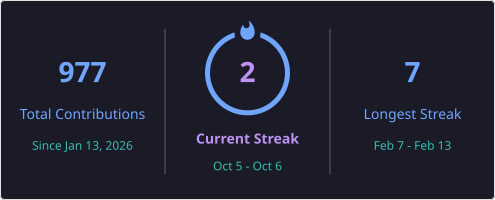

---

## 💫 About Me

- 💻 Software Development Intern @ **Tekdi Technologies**
- 🚀 Passionate about building scalable web and mobile apps that solve real-world problems
- 🎯 Currently working with **React.js, Node.js, Firebase, Spring Boot** and API integrations
- 📚 Always learning modern tools, frameworks and best practices
- 🤝 Collaborating with UI/UX and backend teams to deliver features
- 🐞 Debugging and optimizing for performance and scalability

## 🏆 Achievements

| | |
|---|---|
| 🥉 | **2× Hackathon Winner** – Innovision Avinya Hackathon (2024 & 2025) |
| 🎖️ | **Smart India Hackathon** Finalist |
| 📌 | Built Education-Path, Mess-Management System, E-commerce Platform, Disaster Response App, Reservation System and more |

## 🛠️ Tech Stack

**Frontend** 
       

**Backend** 
     

**Databases & Cloud** 
    

**Tools & Deployment** 
     

**Data / ML** 
   

## 📊 GitHub Stats

## 🏅 GitHub Trophies

## 📫 Let's Connect

*⭐ From a ❤️ of open source — thanks for visiting!*

